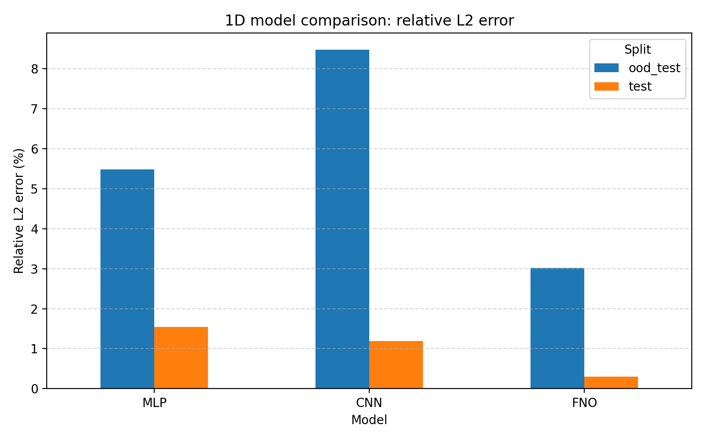
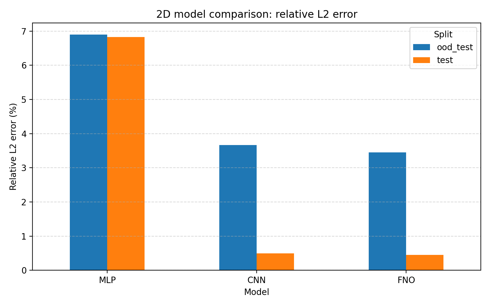
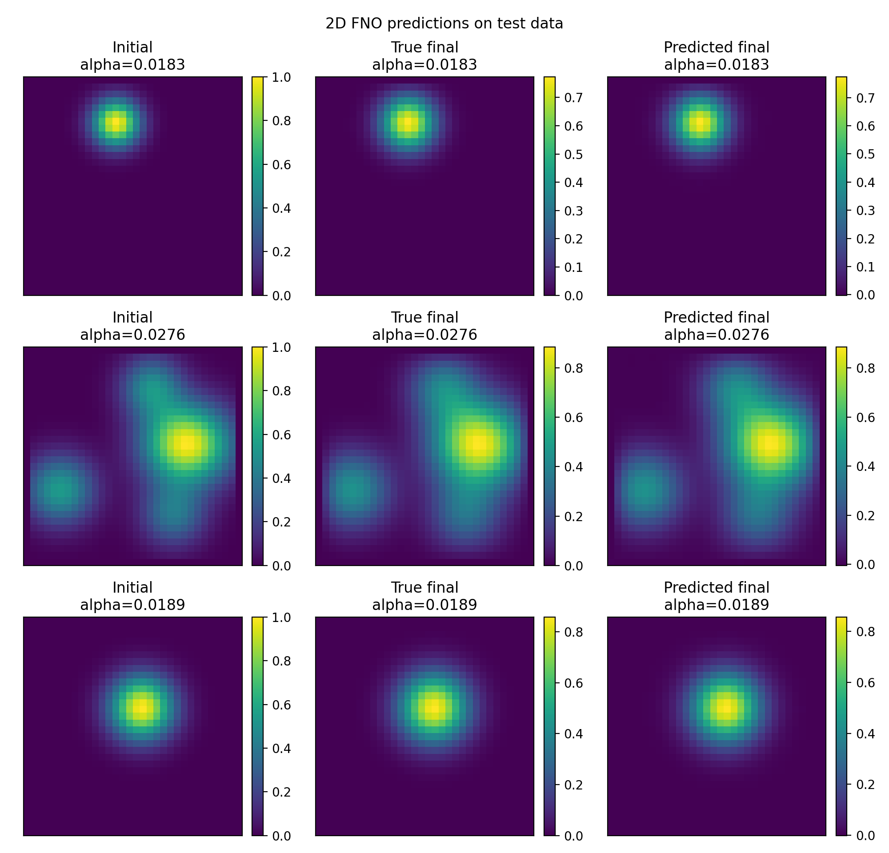
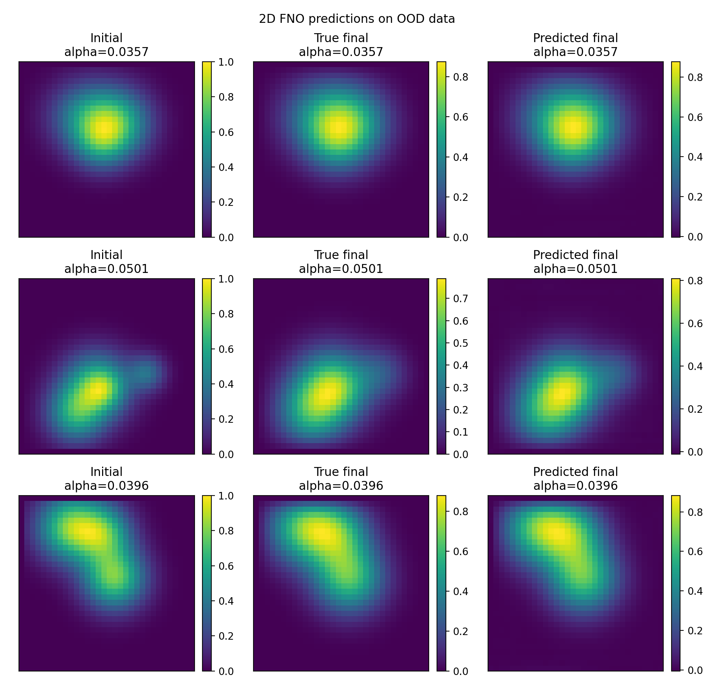

# Neural PDE Surrogate Benchmark

**Configurable PyTorch benchmark for 1D and 2D PDE surrogate modelling using MLP, CNN, and Fourier Neural Operator-style architectures.**

This project builds a compact scientific machine learning workflow for learning neural surrogates of heat-equation simulations:

```text
finite-difference PDE solver → simulation dataset → neural surrogate models → ID/OOD evaluation → model comparison
```

The benchmark compares classical neural-network baselines with Fourier Neural Operator-style models for field-to-field prediction tasks.

---

## Overview

Scientific and engineering simulations are often expensive to run repeatedly. Neural surrogate models can approximate simulator outputs much faster after training, but their reliability depends on both accuracy and generalization outside the training distribution.

This project implements a reproducible simulation-to-ML pipeline for the heat equation:

- finite-difference solvers for 1D and 2D heat equations
- synthetic PDE dataset generation
- configurable YAML-based experiments
- PyTorch training pipeline for MLP, CNN, and FNO-style models
- in-distribution and out-of-distribution evaluation


---

## Problem formulation

The heat equation is

```math
\frac{\partial u}{\partial t}
=
\alpha \nabla^2 u
```

where \(u\) is the temperature field, \(\alpha\) is the diffusion coefficient, and \(\nabla^2 u\) is the spatial Laplacian.

The surrogate modelling task is:

```math
u(0), \alpha \rightarrow u(T)
```

Given an initial temperature field and a diffusion coefficient, the model predicts the final temperature field after a fixed simulation time.

---

## Supported benchmarks

| Benchmark | Input field | Output field | Models |
|---|---:|---:|---|
| 1D heat equation | `(128,)` | `(128,)` | MLP, CNN1D, FNO1D |
| 2D heat equation | `(32, 32)` | `(32, 32)` | MLP, CNN2D, FNO2D |

---

## Dataset

Datasets are generated using explicit finite-difference solvers.

| Split | Samples | Diffusion coefficient range | Purpose |
|---|---:|---:|---|
| Train | 2000 | 0.005–0.030 | Model training |
| Validation | 300 | 0.005–0.030 | Checkpoint selection |
| Test | 300 | 0.005–0.030 | In-distribution evaluation |
| OOD test | 300 | 0.035–0.060 | Out-of-distribution evaluation |

The OOD test set uses larger diffusion coefficients than those seen during training. This tests whether the learned surrogate can generalize to stronger unseen diffusion regimes.

---

## Results

### 1D heat equation

| Model | Test relative L2 error | OOD relative L2 error | Parameters |
|---|---:|---:|---:|
| MLP | 1.54% | 5.47% | 197,760 |
| CNN1D | 1.20% | 8.47% | 62,657 |
| FNO1D | **0.30%** | **3.01%** | 287,489 |

### 2D heat equation

| Model | Test relative L2 error | OOD relative L2 error | Parameters |
|---|---:|---:|---:|
| MLP | 6.83% | 6.90% | 1,575,936 |
| CNN2D | 0.50% | 3.67% | 312,257 |
| FNO2D | **0.45%** | **3.45%** | 1,188,385 |

---

## Key findings

- FNO-style models achieved the best overall performance in both 1D and 2D benchmarks.
- CNN models strongly outperformed MLPs on 2D field prediction, showing the importance of spatial inductive bias.
- In 1D, CNN improved in-distribution accuracy compared with MLP but generalized worse on unseen diffusion coefficients.
- The 2D CNN and FNO models both performed well, with FNO giving the best test and OOD results.
- OOD evaluation is essential because in-distribution accuracy alone does not fully describe surrogate reliability.

---

## Example outputs

### 1D model comparison



### 2D model comparison



### 2D FNO prediction examples



### 2D FNO OOD prediction examples



---

## Installation

```bash
git clone https://github.com/adiManethia/neural-pde-surrogate-benchmark.git
cd neural-pde-surrogate-benchmark
pip install -e .
```

For GPU training, install the PyTorch build compatible with your CUDA version.

---

## Usage

Generate datasets:

```bash
python -m neural_pde.generate_data --dim 1
python -m neural_pde.generate_data --dim 2
```

Train all models:

```bash
python -m neural_pde.train --dim 1 --model mlp
python -m neural_pde.train --dim 1 --model cnn
python -m neural_pde.train --dim 1 --model fno

python -m neural_pde.train --dim 2 --model mlp
python -m neural_pde.train --dim 2 --model cnn
python -m neural_pde.train --dim 2 --model fno
```

Compare models:

```bash
python -m neural_pde.compare --dim 1
python -m neural_pde.compare --dim 2
```

---

## Repository structure

```text
configs/                    YAML experiment configurations
src/neural_pde/             main Python package
src/neural_pde/solvers/     finite-difference heat-equation solvers
src/neural_pde/models/      MLP, CNN, and FNO-style model definitions
data/                       generated datasets, ignored by git
checkpoints/                trained checkpoints, ignored by git
results/                    metric tables and comparison CSV files
plots/                      generated prediction and comparison figures
reports/                    technical LaTeX report
notes/                      project notes and interview preparation
```

---

## Technical details

The finite-difference solver generates supervised learning pairs:

```math
(u_0, \alpha) \mapsto u_T
```

where \(u_0\) is the initial temperature field and \(u_T\) is the final field after simulation.

The FNO-style model uses spectral convolution. The field is transformed into Fourier space, selected low-frequency modes are multiplied by learned complex weights, and the result is transformed back to physical space.

For a 1D spectral layer, the core operation is:

```math
Y_{b,o,m}
=
\sum_i X_{b,i,m} W_{i,o,m}
```

where \(b\) is the batch index, \(i\) is the input channel, \(o\) is the output channel, and \(m\) is the Fourier mode.

More detailed derivations of the finite-difference method, boundary conditions, stability criteria, and spectral convolution are included in the technical report.

---

## Technical report

A detailed LaTeX report is included in [`reports/`](reports/), covering:

- 1D and 2D heat-equation finite-difference solvers
- boundary conditions and numerical stability
- surrogate modelling formulation
- MLP, CNN, and FNO-style architectures
- Fourier spectral convolution
- in-distribution and OOD evaluation
- result analysis, limitations, and future work


## Limitations and future work

Current limitations:

- the benchmark uses the heat equation, which is linear and smooth
- the 2D grid is currently `32 × 32`
- only diffusion-coefficient OOD shift is tested
- uncertainty estimation is not included yet
- active learning is not included yet

Possible extensions:

- scale 2D experiments to `64 × 64`
- add Burgers equation or reaction-diffusion equation
- add multi-time-step prediction
- add uncertainty estimation using ensembles
- add active learning for simulation selection
- benchmark neural surrogate inference time against the finite-difference solver
